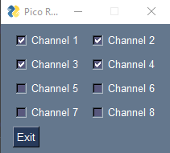

# WaveshareRelayControl
Relay control library for the Waveshare Pico Relay B device

This library allows as user to control relay status (on/off) and perhaps other things as the library / firmware evolves. 

See 
https://github.com/ElDuderino/RP2040SerialGPIOControl for the firmware to use. 

The library currently supports 3 functions:

1) ```set_default_state()``` Turns off all the relay channels
2) ```set_channel_on(channel)``` Turns on the specified channel (channels are defined in WaveshareDef)
3) ```set_channel_off(channel)``` Turns off the specified channel (channels are defined in WaveshareDef)

## Usage
The example below shows how WaveshareDef maps the correct channel then:
1) Turns off all the channels.
2) Turns on all channels one by one
3) Turns off all channels one by one

```
from waveshare_defs import WaveshareDef
from relaycontrolmain import WaveshareRelayController
import time

if __name__ == "__main__":
    # ensure we can convert to channel int
    print(int(WaveshareDef.CH1.value))
    
    # initialize the WaveshareRelayController class
    relay_controller = WaveshareRelayController("COM49")
    
    # connect the serial port
    relay_controller.connect()
    
    # turn off all the relays
    relay_controller.set_default_state()
    time.sleep(1.0)
    
    # iterate through all the channels and turn each one on
    for ch in WaveshareDef:
        relay_controller.set_channel_on(ch)
        time.sleep(0.05)
    
    # iterate through all the channels and turn each one off
    for ch in WaveshareDef:
        relay_controller.set_channel_off(ch)
        time.sleep(0.05)


```

## GUI Control
There's also a small GUI (pysimplegui based) to enable/disable each relay channel:



Run it with ``python3 simple_gui.py``

## Config
See testcfg.cfg, there are only two config lines:

Setting the serial port: ``serial_port=COM49``

Setting the default relay states (set_default_states() is called): ``default_relay_states = 1:True,2:True,3:True,4:True,5:False,6:False,7:False,8:False``
The relay states are comma-delimited pairs of channel:state pairs where the state is True (on) or False (off)

